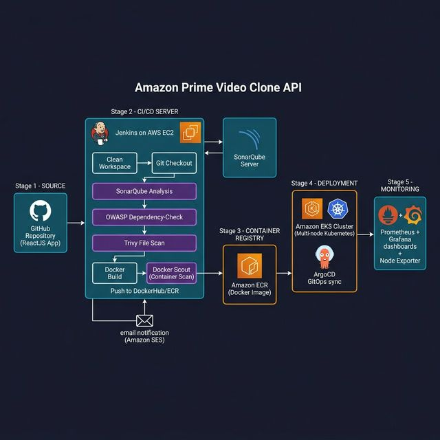

# Amazon Prime Video Clone – DevSecOps CI/CD Deployment on AWS EKS

## Project Overview
This project demonstrates a complete **DevSecOps CI/CD pipeline** for deploying an Amazon Prime Video clone application built with ReactJS. The pipeline automates the entire software delivery lifecycle — from source code checkout to containerized deployment on a managed Kubernetes cluster — while embedding security scanning at every stage.

The architecture follows industry best practices for shift-left security, GitOps-based delivery, and production-grade observability.

## Tools & AWS Services Used
- **AWS EC2**: Hosts the Jenkins CI/CD server.
- **Amazon EKS**: Managed Kubernetes cluster for container orchestration.
- **Amazon ECR**: Private container image registry.
- **Jenkins**: Orchestrates the full CI/CD pipeline.
- **Docker**: Containerizes the ReactJS application.
- **SonarQube**: Performs static code analysis (SAST) for code quality and vulnerabilities.
- **OWASP Dependency-Check**: Scans project dependencies for known CVEs.
- **Trivy**: Scans the filesystem and Docker images for vulnerabilities.
- **Docker Scout**: Provides container image security insights and recommendations.
- **ArgoCD**: Implements GitOps-based continuous delivery to Kubernetes.
- **Prometheus + Grafana**: Provides full-stack monitoring and dashboards for the EKS cluster.
- **Node Exporter (Helm)**: Exports node-level metrics to Prometheus.
- **AWS IAM**: Manages roles and permissions across services.

## Architecture
### Pipeline Workflow
1. **GitHub** (Source Code) → **Jenkins** (CI/CD Trigger)
2. **Jenkins Pipeline Stages**:
   - Clean Workspace → Git Checkout → SonarQube Analysis → Quality Gate
   - OWASP Dependency-Check → Trivy Filesystem Scan
   - Docker Build → Docker Scout (Image Scan) → Push to DockerHub / Amazon ECR
3. **Amazon ECR** → **Amazon EKS** (Kubernetes Deployment via ArgoCD GitOps)
4. **Prometheus + Grafana** → Cluster and application monitoring
5. **Email Notifications** → Build status, logs, and Trivy reports via Jenkins post-build

### Architecture Diagram

## Features
- Automated end-to-end CI/CD pipeline
- Shift-left security with SAST, dependency scanning, and container scanning
- GitOps-based Kubernetes deployment with ArgoCD
- Multi-node EKS cluster provisioned with eksctl
- Real-time cluster monitoring with Prometheus and Grafana
- Automated email alerts with attached security scan reports

## Demo
[Watch Demo](demo-recording.mov)
