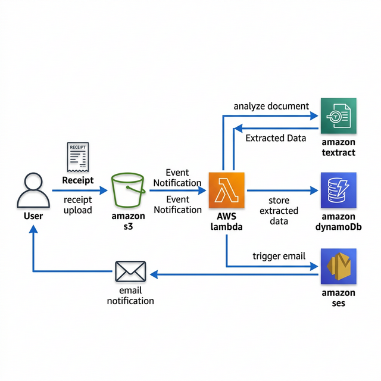

# Automated Receipt Processing System

## Project Overview
This project builds an automated receipt processing system using cloud AI and serverless services. When a receipt image or PDF is uploaded, the system automatically extracts structured information such as store name, total amount, tax, and purchase date.

The extracted data is stored in a database and a notification email is sent once processing is completed.

## AWS Services Used
- **Amazon S3**: Stores uploaded receipt images and PDFs.
- **AWS Lambda**: Automates the workflow.
- **Amazon Textract**: Extracts structured text from receipts.
- **Amazon DynamoDB**: Stores extracted receipt information.
- **Amazon Simple Email Service (SES)**: Sends email notifications after processing.
- **AWS Identity and Access Management (IAM)**: Handles permissions.

## Architecture
### Workflow
**Receipt Upload** → **Amazon S3** → **Lambda Trigger** → **Amazon Textract** → **Extracted Data** → **DynamoDB** → **Email Notification (SES)**

### Architecture Diagram

## Features
- Automated receipt data extraction
- OCR-based document processing
- Event-driven automation
- Structured data storage
- Email notifications
