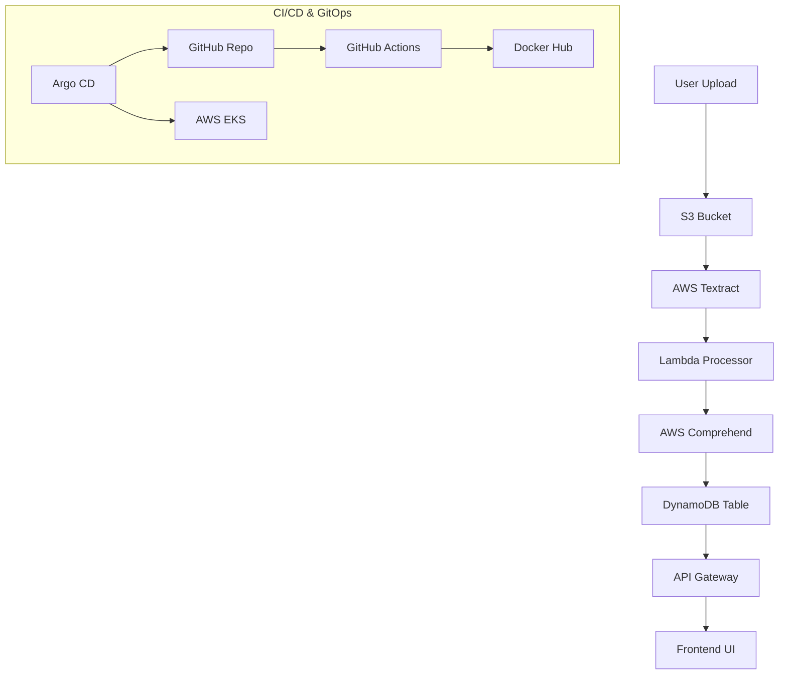

# Blood Fit - AI-Powered Medical Report Analysis System

An enterprise-grade serverless application designed to automate the extraction and analysis of clinical blood markers from medical reports using AWS AI services.

## 🚀 Key Features
- **AI-Driven Extraction**: Uses Amazon Textract for high-accuracy OCR and Amazon Comprehend for clinical data parsing.
- **Massive Medical Library**: Recognizes 50+ key blood markers across CBC, Metabolic, Lipid, and Endocrine panels.
- **DevSecOps Pipeline**: Fully automated CI/CD using GitHub Actions and containerization via Docker.
- **GitOps Deployment**: Automated cluster synchronization using Argo CD on AWS EKS.

## 🏗️ Architecture

## 🛠️ Tech Stack
- **AI/ML**: AWS Textract, AWS Comprehend
- **Compute**: AWS Lambda, AWS EKS
- **Database**: Amazon DynamoDB, Amazon S3
- **DevOps**: GitHub Actions, Docker, ArgoCD, Terraform

## 📺 Demo
Click the `demo-recording.mov` file in this folder to see the full pipeline in action!
