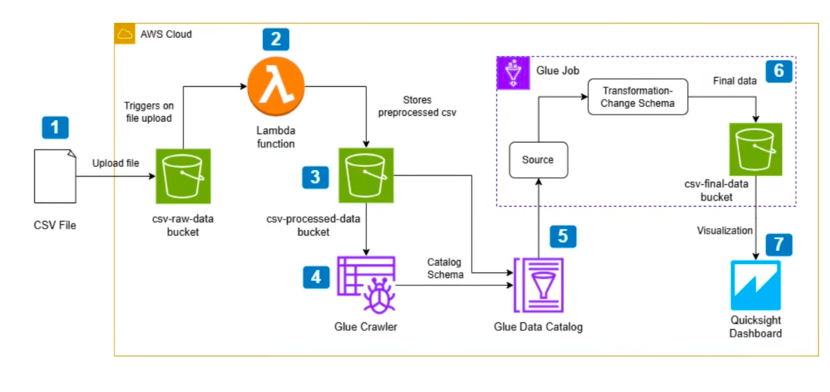

# End-to-End Serverless Data Pipeline

## Project Overview
This project demonstrates how to build a fully automated serverless data pipeline on AWS. Raw CSV data is uploaded to cloud storage, automatically processed and cataloged, and then visualized using a business intelligence dashboard.

The pipeline enables data transformation, querying, and visualization without managing servers.

## AWS Services Used
- **Amazon S3**: Stores raw datasets.
- **AWS Lambda**: Triggers workflow automation.
- **AWS Glue**: Runs crawlers and ETL jobs to prepare data.
- **Amazon Athena**: Queries processed datasets.
- **Amazon QuickSight**: Builds dashboards for data visualization.
- **AWS Identity and Access Management (IAM)**: Manages roles and permissions.

## Architecture
### Workflow
**CSV Upload** → **Amazon S3** → **Lambda Trigger** → **AWS Glue Crawler** → **AWS Glue ETL Job** → **Amazon Athena Query** → **Amazon QuickSight Dashboard**

### Architecture Diagram

## Features
- Automated data ingestion
- ETL data transformation
- Serverless data analytics pipeline
- SQL-based data querying
- Interactive business dashboards
