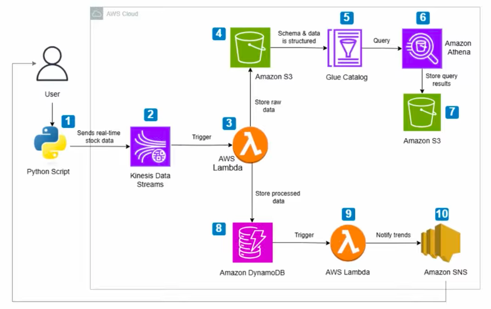

# Real-Time Stock Market Data Analytics Pipeline

## Project Overview
This project implements a real-time stock market analytics pipeline using serverless and event-driven cloud services. The system ingests stock market data in real time, processes the data to detect trends, stores structured records for quick lookup, and sends notifications when specific conditions are met.

The architecture is designed to be scalable, automated, and cost-efficient.

## AWS Services Used
- **Amazon Kinesis Data Streams**: Ingests real-time stock data.
- **AWS Lambda**: Processes incoming stock events.
- **Amazon DynamoDB**: Stores structured stock records.
- **Amazon S3**: Stores raw stock data for historical analysis.
- **Amazon Athena**: Queries data stored in S3.
- **Amazon Simple Notification Service (SNS)**: Sends alerts via email/SMS.
- **AWS Identity and Access Management (IAM)**: Manages permissions.

## Architecture
### Workflow
1. **Stock Data Producer** → **Kinesis Data Stream**
2. **Kinesis Data Stream** → **Lambda Function**
3. **Lambda Function** → **DynamoDB** (Store Processed Data)
4. **Lambda Function** → **SNS** (Send Alerts)
5. **Raw Data** → **S3** → **Athena** (Query for Analysis)

### Architecture Diagram

## Features
- Real-time data ingestion
- Event-driven processing
- Serverless architecture
- Historical data analysis
- Automated notifications

## Demo
[Watch Demo](demo-recording.mov)
